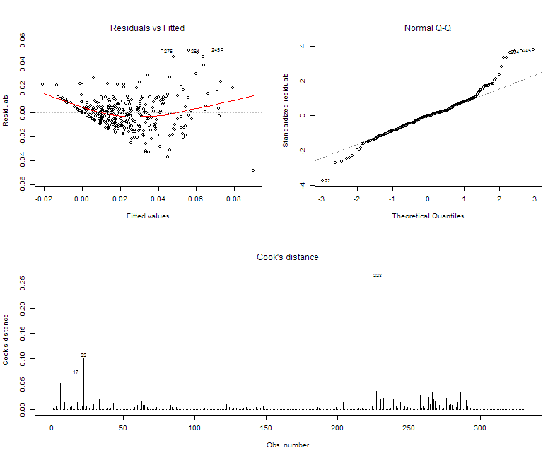

## Data Analysis and Scoring Model:
### Estimated Impact of Prospective Myanmar Solar Electrification Funding
By Jude Calvillo & Catherine Zhang  
[Data Science Working Group @ Code for SF](https://datascience.codeforsanfrancisco.org)  
For Entry into the U.S. State Department's Myanmar Energy Tech Challenge

### Overview
This is our team's first attempt at a model to score the potential impact of public or private funding on the solar electrification of any given township within today's Myanmar. For now, the 'success' it is trying to predict for is derived from the solar electrification rates from a single year (2014) but will soon be sharpened to include only those cases where solar electrification has been online for at least 5 years. This is because our team believes _continued success_ should serve as a respectable proxy for measures like Willingness to Pay, given the budgetary/revenue models that have proven successful in other emerging markets.  

The v1 method itself is fairly simple: a manually honed linear model, for interpretability and for insights toward building future models. In our scoring system (below), this model's predicted solar electrification rates (i.e. some degree of success) are balanced against the actual current electrification rate of each township, so as to effectively result in estimates of _relative unmet demand from townships where solar electrification should be successful_. These estimates are then rescaled from 0 to 10 to present a more intuitive score of a funding decision's relative impact from within a forthcoming user interface.  

### Data Sources 
+ [Myanmar Census, 2014](https://data.opendevelopmentmekong.net/dataset/be760472-6224-4d73-b309-335d732cab93/resource/702f8d11-8301-4661-b7b8-030501a90626/download/HouseholdPopulationbaseddatasetMIMUTownshipsabbreviated.csv)
    - [Data dictionary](https://data.opendevelopmentmekong.net/dataset/be760472-6224-4d73-b309-335d732cab93/resource/f33a6208-ce00-49ec-bac4-f3a5f02c4a3c/download/datadictionaryhhpoptownships.csv)
+ Future sources: TBD  
    - Interested contributors can find more sources at [Booz | Allen | Hamilton's Sailfish Data Exchange >>](https://energytechchallenge.sailfish.boozallen.com/)  

### Status  
+ Seeking other per-township data sources to join with and help hone our model.
+ Will attempt to find data sources from similar markets, then normalize values from matching variables and attempt to generalize our model (for robustness and replicability, per Booz-Allen's request).  
+ May shift this to an entirely Willingness-to-Pay-based model, if we can find more data on electrical source substitution.  

### Exploratory Analysis
First, let's explore the prior distribution, visually, by plotting the frequency of rates by state

```r
install.packages("tidyverse")
library("tidyverse")

ggplot(data = census14, mapping = aes(x = light_sol)) +
  geom_freqpoly(mapping = aes(color = name_st), binwidth = mean(census14$light_sol, na.rm = TRUE))
```

### Munging
Let's normalize by household population

```r
install.packages("dplyr")

census14_combined <- merge(x = census14, y = census14.labour, by = "pcode_ts", all = TRUE)

census14_combined$light_sub <- census14_combined$light_t +
                               census14_combined$light_elec +
                               census14_combined$light_kero +
                               census14_combined$light_cand +
                               census14_combined$light_batt + 
                               census14_combined$light_gen + 
                               census14_combined$light_wat +
                               census14_combined$light_oth

census14_combined$light_sub_rate <- census14_combined$light_sub / 
                                                    census14_combined$pop_hh.x
census14_combined$light_sol_rate <- census14_combined$light_sol / 
                                                    census14_combined$pop_hh.x
census14_combined$light_elec_rate <- census14_combined$light_elec/ 
                                                    census14_combined$pop_hh.x

light_model <- subset(census14_combined, select = c("pop_hh.x",
                                                    "light_sol_rate",
                                                    "light_elec_rate"
                                                    )
                      )
```

### Modeling & Diagnostics
Let's run a comprehensive linear regression to see our predictive potential here. You'll note below that we've been careful to exclude _light electrifciation rate_ from our model, as that could seriously corrupt our results.   


**Adjusted R-Squared and Significant Variables (in descending order of influence)**  

## Quick LM (minus biasing variable, light_elec_rate, and useless township code) 
## to assess predictive potential
```r
lm1 <- lm(light_sol_rate ~ . -light_elec_rate, data = light_model)
```

## Print adjusted R^2 to gauge potential accuracy
```r
print(paste("Adjusted R-Squared:", round(summary(lm1)$adj.r.squared, 3)))
```

```
## [1] "Adjusted R-Squared: 0.622"
```

```r
## Print most influential variables
coef_table <- as.data.frame(summary(lm1)$coefficients)
coef_table <- coef_table[order(-abs(coef_table$Estimate)),]
coef_table <- coef_table[coef_table$`Pr(>|t|)` < .1,]
print(coef_table)
```

```
##                          Estimate  Std. Error    t value     Pr(>|t|)
## hh_f_rate              0.64709194 0.083430602   7.756050 1.303207e-13
## hh_m_rate              0.36292422 0.058027118   6.254390 1.336535e-09
## retir_rate            -0.27483082 0.086445993  -3.179220 1.627410e-03
## light_substitute_rate -0.27450922 0.027381317 -10.025421 1.195257e-20
## hhwork_rate            0.27334456 0.064351859   4.247656 2.867192e-05
## unpfam_rate            0.26738865 0.053209942   5.025163 8.557330e-07
## ownacc_rate            0.22869604 0.052906943   4.322609 2.086093e-05
## (Intercept)           -0.17780749 0.055637840  -3.195801 1.539580e-03
## stu_rate               0.16719443 0.051346339   3.256209 1.255388e-03
## empyr_rate             0.16688190 0.085494882   1.951952 5.185282e-02
## ownshp_rent_rate      -0.06864519 0.033734869  -2.034844 4.272550e-02
## ownshp_own_rate       -0.05253324 0.026621060  -1.973371 4.934985e-02
## pop_r_rate             0.03575927 0.012363379   2.892354 4.096906e-03
## housing_bamb           0.01270348 0.005111821   2.485119 1.348315e-02
```

With an adjusted R^2 of just .62, the above reveals that our first attempt at a predictive model probably won't be very useful, but hopefully we can improve upon it. Let's diagnose, via the three plots below, and then systematically investigate using the variables we know to be influential (above):  

+ **Residuals vs. Fitted values:** Is there a non-linear relationship between our predictor variables and the outcome?  
    - It appears we are bordering on a non-linear relationship, which could be troublesome, but this is our first draft, so we expect future models to perform much better. 
+ **Normality:** Do the outcome observations align with the theoretical quantiles of a normal distribution?  
    - For the most part, yes, but there do appear to be some outliers or borderline outliers, so we must investigate further.  
+ **Cook's Distance:** Which observations have an unusual degree of _leverage_ over the model?
    - We can spot three cases, #s 17, 28, and 228, whose Cook's distance is highly pronounced and should be investigated.  

```r
## Layout w/plots 1st and 2nd plot in first row and 3rd plot in second row.
layout(matrix(c(1,2,3,3), 2, 2, byrow = TRUE))

## Review model diagnostics
plot(fit1, 1) # Residuals vs. fitted
plot(fit1, 2) # Normality
plot(fit1, 4) # Cook's distance
```


  
  
**Investigating Cases with an Unusually High Degree of Leverage**  
What can explain the unusual degree of leverage over the model from each of these three cases? To explore this, let's review these records and compare their values to those of some variables' summary statistics.   

```r
## Let's investigate those 3 observations whose Cook's Distance is skewing our fit.
print(fullset[c(17,22,228),])
```

```
##      pcode_ts pop_hh_rate hh_m_rate hh_f_rate pop_r_rate pop_u_rate
## 17  MMR001018     0.00024   0.12909   0.01796    0.96304    0.03868
## 22  MMR002004     0.00014   0.17695   0.03771    0.78916    0.24015
## 228 MMR013032     0.00002   0.27560   0.02389    0.00000    1.65529
##     govemp_rate priemp_rate empyr_rate ownacc_rate unpfam_rate seekw_rate
## 17      0.01306     0.00632    0.00811     0.20887     0.18022    0.01243
## 22      0.05196     0.02289    0.00577     0.49214     0.18953    0.01015
## 228     0.19256     0.52156    0.00827     0.03721     0.04371    0.00413
##     stu_rate hhwork_rate retir_rate ill_rate ownshp_own_rate
## 17   0.29640     0.21982    0.04066  0.00179         0.99123
## 22   0.14095     0.04141    0.02946  0.00816         0.96444
## 228  0.06615     0.10455    0.01418  0.00413         0.37607
##     ownshp_rent_rate housing_apt housing_bung housing_wood housing_bamb
## 17           0.00000       0e+00      0.00000      0.00010      0.83226
## 22           0.00640       0e+00      0.00000      0.00022      0.67568
## 228          0.03989       4e-04      0.00011      0.00136      0.01425
##     light_elec_rate light_substitute_rate light_solar_rate
## 17          0.01255               0.13434          0.00017
## 22          0.05115               0.00000          0.04183
## 228         0.27816               0.00000          0.00000
```
  
  
**Case #228 (Cocokyun): Well Electrified but Not At All Solar**  
Given its high electrification rate (below), yet low solar electrification rate, case #228 (MMR001018: Kwanglanghphu) is an obvious case of _non-solar_ electrification. 


```r
## 228's electrification rate
print(paste("228's Electrification Rate:", fullset$light_elec_rate[228]))
```

```
## [1] "228's Electrification Rate: 0.27816"
```

```r
## Light electrification rate summary stats
print(summary(fullset$light_elec_rate))
```

```
##    Min. 1st Qu.  Median    Mean 3rd Qu.    Max. 
## 0.00478 0.02348 0.04958 0.06979 0.09119 0.27820
```

```r
## 228's solar electrification rate
print(paste("228's Solar Electrification Rate:", fullset$light_solar_rate[228]))
```

```
## [1] "228's Solar Electrification Rate: 0"
```

Furthermore, Cocokyun's high urban population rate and non-existant rural population rate cue us to a fundamental conceptual issue in our modeling so far. That is, if we are trying to prioritize electrification investment in rural areas, then we should be subsetting our cases to areas that are mostly rural, so let's try our model again, except with only the rural cases included...  

**Model 2: Fitting to Rural Areas**  
You'll note that fitting to only rural areas produces a substantially more explanatory model for predicting solar electrification rates. Whereas our adjusted R^2 was initially .62, now it's at about .69, which is a very respectable start, absent other data.  


```r
## Subset to those townships whose rural pop rate is >= .9
rural <- fullset[fullset$pop_r_rate >= .9,]
lm2 <- lm(light_solar_rate ~ . -light_elec_rate, data = rural[,-1])

## Print adjusted R^2 to gauge potential accuracy
print(paste("Adjusted R-Squared:", round(summary(lm2)$adj.r.squared, 3)))
```

```
## [1] "Adjusted R-Squared: 0.693"
```

```r
## Print most influential variables
coef_table2 <- as.data.frame(summary(lm2)$coefficients)
coef_table2 <- coef_table2[order(-abs(coef_table2$Estimate)),]
coef_table2 <- coef_table2[coef_table2$`Pr(>|t|)` < .1,]
print(coef_table2)
```

```
##                           Estimate   Std. Error    t value     Pr(>|t|)
## housing_apt           780.06391294 287.15687499   2.716508 7.625946e-03
## pop_hh_rate            -1.85473372   1.09803270  -1.689143 9.392546e-02
## hh_f_rate               0.87053464   0.11936523   7.293034 4.308988e-11
## hh_m_rate               0.58329452   0.08834196   6.602689 1.336179e-09
## light_substitute_rate  -0.50022741   0.04454137 -11.230625 3.693822e-20
## seekw_rate              0.39366499   0.16561059   2.377052 1.911711e-02
## hhwork_rate             0.37643052   0.08871141   4.243316 4.505764e-05
## ownacc_rate             0.33796907   0.07709337   4.383893 2.608646e-05
## empyr_rate              0.30635487   0.11687195   2.621287 9.954749e-03
## unpfam_rate             0.30224875   0.07222506   4.184819 5.637391e-05
## retir_rate             -0.29006834   0.12718816  -2.280624 2.442912e-02
## (Intercept)            -0.28318440   0.08860547  -3.196015 1.802996e-03
## stu_rate                0.17887058   0.06985644   2.560545 1.175787e-02
## priemp_rate             0.15026854   0.07219251   2.081498 3.962717e-02
## pop_r_rate              0.03917304   0.02128609   1.840312 6.832352e-02
```

**Model 2: Post Diagnostics**  
Rather than go through another full set of diagnostics, I'll simply share that a recurring problem appears to be cases in which the Myanmar Census indicates a population rate greater than 1.0 (e.g. rural population rate > 1), as demonstrated by a few such records below.  


```
##      pcode_ts pop_r_rate pop_u_rate
## 9   MMR001009    1.56846    0.38854
## 60  MMR005023    1.04024    0.06022
## 71  MMR005034    1.19402    0.10691
## 129 MMR009013    1.08184    0.10132
## 142 MMR010001    0.00000    1.10045
## 143 MMR010002    0.00000    1.23134
## 144 MMR010003    0.00000    1.10742
## 145 MMR010004    0.00000    1.06187
```

We must now revisit the data collection protocols of Myanmar's Census to see if there are addressable systemic issues in their recording of population rates. If not, then we would suggest that Myanmar's government consider enforcing more rigorous protocols for recording such rates in order to correct some apparent scaling issues.  

**Models 3 and 4: Urban and 'Other' Populations**  
If we are to have a model for clearly rural populations, then it follows that we should have models for clearly urban populations and everything in between...  


```r
## Subset to those townships whose urban pop rate is >= .9
urban <- fullset[fullset$pop_u_rate >= .9,]
lm3 <- lm(light_solar_rate ~ . -light_elec_rate, data = urban[,-1])

## Print most influential variables
coef_table3 <- as.data.frame(summary(lm3)$coefficients)
coef_table3 <- coef_table3[order(-abs(coef_table3$Estimate)),]
coef_table3 <- coef_table3[coef_table3$`Pr(>|t|)` < .1,]

## Subset to those townships who are neither clearly urban nor clearly rural
## I.E. Urban pop rate < .9 and Rural pop rate < .9
other <- fullset[fullset$pop_u_rate < .9 & fullset$pop_r_rate < .9,]
lm4 <- lm(light_solar_rate ~ . -light_elec_rate, data = other[,-1])

## Print most influential variables
coef_table4 <- as.data.frame(summary(lm4)$coefficients)
coef_table4 <- coef_table4[order(-abs(coef_table4$Estimate)),]
coef_table4 <- coef_table4[coef_table4$`Pr(>|t|)` < .1,]

## Print adjusted R^2 to gauge potential explanatory power
print(paste("Adjusted R-Squared for Urban LM:", round(summary(lm3)$adj.r.squared, 3)))
```

```
## [1] "Adjusted R-Squared for Urban LM: 0.799"
```

```r
print(paste("Adjusted R-Squared for 'Other' LM:", round(summary(lm4)$adj.r.squared, 3)))
```

```
## [1] "Adjusted R-Squared for 'Other' LM: 0.632"
```

We'll save the significant coefficients table for the next section, on drawing insights from comparing our models.  

***

### Insights from Comparing Models  
Insights so far (I'll expand and demonstrate -with figures- in the coming days)...  

+ Though the standard error of this predictor is rather high, apartment living appears to be highly predictive of solar electrification in rural areas.  
    - And apartment living moderately correlates with government employment, which begs the question: has the Myanmar gov't prioritized funding or policy-based funding incentives for communities with relatively high numbers of gov't employees?   
    - Could suggest hedging signal to private investors.  
+ High R^2 of Urban model, as well as the Urban subset's highly normal distribution of solar electrification, suggests that policymakers -and/or private investors- are more responsive to the need for solar electrification in urban townships.  
    - This appears to be independent of the variance in population density within such areas.  
    - Is this due to proximity to non-solar power... or proximity to political power?  
+ Aside from population rates, and the rarity of apartment living in rural townships, light substitution rate does appear to be a useful inverse predictor of solar electrification, particularly for rural areas.  


### Scoring  
This is coming!

### Keywords
u.s. state department, booz allen hamilton, energy tech challenge, myanmar, burma, energy, solar electrification, solar micro-grids.  

